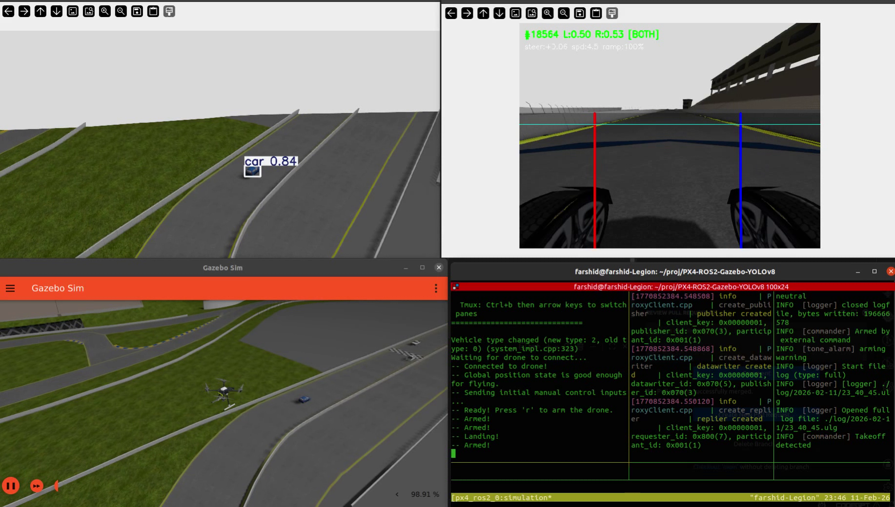

# PX4-ROS2-Gazebo-YOLOv8

<p align="center">
  
</p>

Aerial Object Detection using a Drone with PX4 Autopilot or ArduPilot, ROS 2, Gazebo Garden, and YOLOv8. Includes a vision-based autonomous lane-keeping car on Sonoma Raceway.

Two autopilot stacks are supported — choose based on your hardware:
- **ArduPilot/ArduCopter** — for Pixhawk 6X/6C (STM32H753 @ 480 MHz) and other ArduCopter hardware
- **PX4 Autopilot** — for PX4-based flight controllers

## Demo

https://github.com/user-attachments/assets/878b75fd-134b-4159-94c9-36afef6882e8

## Features
- Keyboard-controlled drone flight (WASD + arrow keys) via MAVSDK
- 3-axis gimbal camera control (pitch, yaw, roll)
- ArduCopter flight mode switching (Loiter, AltHold, Guided, Stabilize, Land)
- YOLOv8 real-time object detection (persons and cars)
- **Vision-based lane keeping** — hatchback car autonomously drives Sonoma Raceway using camera + OpenCV
- Tmuxinator orchestration — all services in a single tiled-pane window
- Docker with GPU passthrough and X11 forwarding

## Lane Keeping

The hatchback car on Sonoma Raceway drives itself using a forward-facing camera and OpenCV-based yellow lane detection. No waypoints or pre-mapped paths — pure vision.

**How it works:**
- HSV thresholding detects yellow lane lines from the car's camera (640x480 @ 15Hz, 120° FOV)
- Near-field classification (bottom half of image) prevents lane misdetection in sharp curves
- Adaptive PID controller: gain scales quadratically with lane proximity — gentle on straights, aggressive near walls
- Road curvature feedforward: averages both lane angles to steer into curves even when centered
- Trend steering: slow-moving average remembers the turn direction so the car doesn't straighten out when lanes temporarily vanish
- Merge detection: when both lanes converge (on-ramp merge), the car steers right for 2 seconds then resumes normal lane keeping
- Speed control: 2.5–5.0 m/s, exponential ramp-up on straights, drops during corrections, crawls at 1 m/s with no lanes

**Debug output:**
- OpenCV window with lane overlay, danger scores, steering angle, speed, and frame number
- CSV log at `/tmp/lane_keeping_log.csv` with per-frame telemetry

## Docker

Two Dockerfiles are provided:
- `Dockerfile` — ArduPilot/ArduCopter (default)
- `Dockerfile.px4` — PX4 Autopilot

### ArduPilot (default)
```bash
git clone https://github.com/farshidrayhancv/PX4-ROS2-Gazebo-YOLOv8.git
cd PX4-ROS2-Gazebo-YOLOv8
bash run_ardupilot.sh
```

### PX4
```bash
git clone https://github.com/farshidrayhancv/PX4-ROS2-Gazebo-YOLOv8.git
cd PX4-ROS2-Gazebo-YOLOv8
bash run_px4.sh
```

See [How_to_run.md](How_to_run.md) for the full `docker run` commands if you need to customize flags.

### What Launches in Docker

**ArduPilot** (`Dockerfile` / `run_ardupilot.sh`):

| Pane | Service |
|------|---------|
| 1 | Gazebo Garden simulator |
| 2 | ArduCopter SITL (iris drone with gimbal) |
| 3 | ROS-Gazebo camera bridge |
| 4 | YOLOv8 detection display |
| 5 | Moving car (hatchback driving in circles) |
| 6 | Keyboard drone controller |

**PX4** (`Dockerfile.px4` / `run_px4.sh`):

| Pane | Service |
|------|---------|
| 1 | Micro XRCE-DDS Agent |
| 2 | PX4 SITL (x500_depth drone) |
| 3 | ROS-Gazebo drone camera bridge |
| 4 | YOLOv8 detection display |
| 5 | ROS-Gazebo car camera + cmd_vel bridges |
| 6 | Lane keeping (autonomous car) |
| 7 | Keyboard drone controller |

Switch between panes with `Ctrl+b` then arrow keys.

## Keyboard Controls

### Flight Controls
| Key | Action |
|-----|--------|
| `r` | Arm the drone |
| `l` | Land |
| `w` / `s` | Throttle up / down |
| `a` / `d` | Yaw left / right |
| Arrow keys | Roll / Pitch |
| `i` | Print flight mode |
| `Ctrl+C` | Quit |

### Flight Mode Switching (ArduCopter)
| Key | Mode |
|-----|------|
| `1` | Loiter (position hold) |
| `2` | AltHold (altitude hold) |
| `3` | Guided (autonomous control) |
| `4` | Stabilize (manual) |
| `5` | Land |

### Gimbal Camera Controls
| Key | Action |
|-----|--------|
| `j` / `k` | Gimbal pitch down / up |
| `n` / `m` | Gimbal yaw left / right |

## Architecture

### ArduPilot Stack
```
ArduCopter SITL  <-- JSON/UDP -->  ardupilot_gazebo plugin  <-->  Gazebo Garden
      |                                                              |
      | MAVLink (UDP 14550)                                gz.msgs.Image
      |                                                              |
   MAVSDK Python                                          ROS-GZ bridge
   pymavlink (UDP 14560)                                        |
      |                                                  /camera (ROS 2)
keyboard-mavsdk-test.py                                         |
                                                      uav_camera_det.py (YOLOv8)
```

### PX4 Stack
```
PX4 SITL  <-->  Gazebo Garden (in-process plugin)
    |                    |
Micro XRCE-DDS      Camera sensor
    |                    |
px4_msgs (ROS 2)    ROS-GZ bridge
    |                    |
MAVSDK Python     /camera (ROS 2)
    |                    |
keyboard-mavsdk-test.py  uav_camera_det.py (YOLOv8)
```

## Manual Installation

### ArduPilot

```bash
# Virtual environment
python -m venv ~/ardupilot-venv
source ~/ardupilot-venv/bin/activate

# Clone this repo
git clone https://github.com/farshidrayhancv/PX4-ROS2-Gazebo-YOLOv8.git

# ArduPilot
cd ~
git clone --recurse-submodules https://github.com/ArduPilot/ardupilot.git
cd ardupilot
Tools/environment_install/install-prereqs-ubuntu.sh -y
. ~/.profile
./waf configure --board sitl
./waf copter

# ardupilot_gazebo plugin
cd ~
git clone https://github.com/ArduPilot/ardupilot_gazebo.git
cd ardupilot_gazebo
mkdir build && cd build
cmake .. -DCMAKE_BUILD_TYPE=RelWithDebInfo
make -j$(nproc)

# ROS 2 Humble + Gazebo Garden bridge
sudo apt install ros-humble-desktop ros-dev-tools ros-humble-ros-gzgarden

# Python packages
pip install mavsdk pymavlink aioconsole opencv-python ultralytics numpy

# Bashrc
echo 'source /opt/ros/humble/setup.bash' >> ~/.bashrc
echo 'export GZ_SIM_RESOURCE_PATH=~/.gz/models:~/ardupilot_gazebo/models:~/ardupilot_gazebo/worlds' >> ~/.bashrc
echo 'export GZ_SIM_SYSTEM_PLUGIN_PATH=~/ardupilot_gazebo/build' >> ~/.bashrc
echo 'export PATH=$PATH:~/ardupilot/Tools/autotest' >> ~/.bashrc

# Copy models
cp -r ~/PX4-ROS2-Gazebo-YOLOv8/models/* ~/.gz/models/

# Configure gimbal camera
python ~/PX4-ROS2-Gazebo-YOLOv8/setup_gimbal_ardupilot.py
```

#### Run (ArduPilot)
```bash
# Terminal 1: Gazebo
gz sim -r ~/ardupilot_gazebo/worlds/ardupilot_default.sdf

# Terminal 2: ArduCopter SITL
cd ~/ardupilot
Tools/autotest/sim_vehicle.py -v ArduCopter -f gazebo-iris --model JSON --console \
  --add-param-file ~/PX4-ROS2-Gazebo-YOLOv8/ardupilot_sitl.parm \
  --out=udp:127.0.0.1:14550 --out=udp:127.0.0.1:14560 \
  -l 47.397971,8.546164,0,0

# Terminal 3: Camera bridge
ros2 run ros_gz_bridge parameter_bridge \
  /drone/camera@sensor_msgs/msg/Image[gz.msgs.Image \
  --ros-args -r /drone/camera:=/camera

# Terminal 4: YOLOv8 detection
cd ~/PX4-ROS2-Gazebo-YOLOv8 && python uav_camera_det.py

# Terminal 5: Moving car
cd ~/PX4-ROS2-Gazebo-YOLOv8 && python move_car.py

# Terminal 6: Keyboard controller
cd ~/PX4-ROS2-Gazebo-YOLOv8 && python keyboard-mavsdk-test.py
```

### PX4

```bash
# Virtual environment
python -m venv ~/px4-venv
source ~/px4-venv/bin/activate

# Clone this repo
git clone https://github.com/farshidrayhancv/PX4-ROS2-Gazebo-YOLOv8.git

# PX4 Autopilot
cd ~
git clone https://github.com/PX4/PX4-Autopilot.git --recursive
bash ./PX4-Autopilot/Tools/setup/ubuntu.sh
cd PX4-Autopilot && make px4_sitl

# Micro XRCE-DDS Agent
cd ~
git clone https://github.com/eProsima/Micro-XRCE-DDS-Agent.git
cd Micro-XRCE-DDS-Agent && mkdir build && cd build
cmake .. && make && sudo make install && sudo ldconfig /usr/local/lib/

# ROS 2 Humble + Gazebo Garden bridge
sudo apt install ros-humble-desktop ros-dev-tools ros-humble-ros-gzgarden

# ROS 2 workspaces
mkdir -p ~/ws_sensor_combined/src && cd ~/ws_sensor_combined/src
git clone https://github.com/PX4/px4_msgs.git
git clone https://github.com/PX4/px4_ros_com.git
cd .. && source /opt/ros/humble/setup.bash && colcon build

# Python packages
pip install mavsdk aioconsole opencv-python ultralytics numpy

# Bashrc
echo 'source /opt/ros/humble/setup.bash' >> ~/.bashrc
echo 'export GZ_SIM_RESOURCE_PATH=~/.gz/models' >> ~/.bashrc

# Copy models and world
cp -r ~/PX4-ROS2-Gazebo-YOLOv8/models/* ~/.gz/models/
cp ~/PX4-ROS2-Gazebo-YOLOv8/worlds/default_docker.sdf ~/PX4-Autopilot/Tools/simulation/gz/worlds/default.sdf

# Configure gimbal camera
python ~/PX4-ROS2-Gazebo-YOLOv8/setup_gimbal.py
```

#### Run (PX4)
```bash
# Terminal 1: DDS bridge
cd ~/Micro-XRCE-DDS-Agent && MicroXRCEAgent udp4 -p 8888

# Terminal 2: PX4 SITL
cd ~/PX4-Autopilot
PX4_SYS_AUTOSTART=4002 PX4_GZ_MODEL_POSE="268.08,-128.22,3.86,0.00,0,-0.7" \
  PX4_GZ_MODEL=x500_depth ./build/px4_sitl_default/bin/px4

# Terminal 3: Drone camera bridge
ros2 run ros_gz_bridge parameter_bridge \
  /world/default/model/x500_depth_0/link/camera_link/sensor/IMX214/image@sensor_msgs/msg/Image[gz.msgs.Image \
  --ros-args -r /world/default/model/x500_depth_0/link/camera_link/sensor/IMX214/image:=/camera

# Terminal 4: YOLOv8 detection
cd ~/PX4-ROS2-Gazebo-YOLOv8 && python uav_camera_det.py

# Terminal 5: Car camera + cmd_vel bridges
ros2 run ros_gz_bridge parameter_bridge \
  /car/camera@sensor_msgs/msg/Image[gz.msgs.Image \
  '/model/hatchback_blue_1/cmd_vel@geometry_msgs/msg/Twist]gz.msgs.Twist' \
  --ros-args -r /car/camera:=/car_camera

# Terminal 6: Lane keeping (autonomous car)
cd ~/PX4-ROS2-Gazebo-YOLOv8 && python lane_keeping.py

# Terminal 7: Keyboard controller
cd ~/PX4-ROS2-Gazebo-YOLOv8 && python keyboard-mavsdk-test.py
```

## Project Structure

| File | Description |
|------|-------------|
| `Dockerfile` | ArduPilot Docker build |
| `Dockerfile.px4` | PX4 Docker build |
| `run_ardupilot.sh` | Build and run ArduPilot Docker |
| `run_px4.sh` | Build and run PX4 Docker |
| `keyboard-mavsdk-test.py` | Keyboard flight control, gimbal, and mode switching |
| `KeyPressModule.py` | Terminal keyboard input handler |
| `uav_camera_det.py` | ROS 2 YOLOv8 detection node |
| `lane_keeping.py` | Vision-based autonomous lane keeping for PX4 |
| `move_car.py` | Drives hatchback in circles for drone tracking (ArduPilot only) |
| `setup_gimbal_ardupilot.py` | Configures gimbal camera for ArduPilot iris model |
| `setup_gimbal.py` | Configures gimbal camera for PX4 x500_depth model |
| `ardupilot_ros2_gazebo.yml` | Tmuxinator config (ArduPilot) |
| `px4_ros2_gazebo.yml` | Tmuxinator config (PX4) |
| `ardupilot_sitl.parm` | ArduCopter SITL parameters |
| `worlds/ardupilot_default.sdf` | Gazebo world (ArduPilot) |
| `worlds/default_docker.sdf` | Gazebo world (PX4) |

## Acknowledgement
- https://github.com/ArduPilot/ardupilot
- https://github.com/ArduPilot/ardupilot_gazebo
- https://github.com/PX4/PX4-Autopilot
- https://github.com/ultralytics/ultralytics
- https://www.ros.org/
- https://gazebosim.org/
